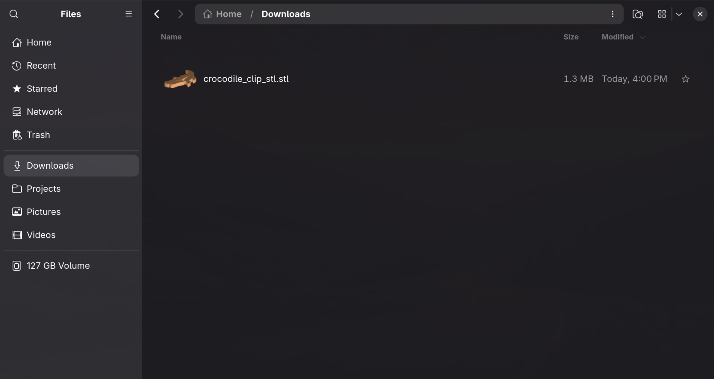

# STL Preview for Omarchy

STL Preview adds shaded, transparent-background thumbnails for `.stl` models in GNOME Files (Nautilus), the file manager used by Omarchy. Its Quattro bar widget provides explicit install and removal actions.

The renderer uses Python's standard library only. It does not need pip packages, a 3D application, or an internet connection. It supports both binary and ASCII STL files. The thumbnails are for browsing and are not a substitute for a 3D viewer when checking a model's shape or dimensions.

## Screenshot



Model: [Bag Clip Crocodile with Lock (Print in Place)](https://www.printables.com/model/1822754-bag-clip-crocodile-with-lock-print-in-place/).

## Install as an Omarchy Quattro plugin

Install the plugin with:

```bash
omarchy plugin add https://github.com/hajimetchi/omarchy_stl_preview.git --enable
```

The **STL** widget appears in the bar's right section. Click it and choose **Install STL previews**. This opens an interactive terminal and runs `install.sh`; the script asks for your administrator password when it installs the renderer under `/usr/local/bin`. The plugin does not run the installer automatically.

Restart GNOME Files (close and reopen it, or log out and back in). Browse to a folder containing `.stl` files and use an icon or grid view. If thumbnails are disabled in Files, enable them in Files preferences. The first preview may take a moment to appear.

## Requirements

The plugin requires Omarchy Quattro, `omarchy-launch-terminal`, `xdg-terminal-exec`, Bash, Python 3, GNOME Files, and `sudo`. The renderer itself uses only Python's standard library and does not need internet access. Optional desktop database utilities are used when present.

## Remove

Use **Remove STL previews** in the widget before removing the plugin with `omarchy plugin remove io.github.hajimetchi.stl-preview`. The removal action asks for your administrator password to delete the renderer from `/usr/local/bin`, then removes this integration's user-level registrations, style block, and failed-thumbnail cache entries. Other GTK style rules are preserved.

## Project files

| File | Purpose |
| --- | --- |
| `manifest.json`, `BarWidget.qml`, `Panel.qml`, `ActionButton.qml` | Declare and implement the Quattro widget and its install/remove panel. |
| `install.sh` | Installs the renderer, registers the thumbnailer and STL file type for your account, and adds the Nautilus thumbnail style. Launched by the widget. |
| `uninstall.sh` | Removes the renderer and registrations, then removes only the style block added by this project. Launched by the widget. |
| `bin/stl-thumbnailer` | Python program that reads an STL mesh and renders a transparent PNG thumbnail. |
| `share/thumbnailers/stl-preview.thumbnailer` | Tells GNOME which command to run to make thumbnails for STL files. |
| `share/mime/packages/stl-preview.xml` | Registers `.stl` files as STL models with the desktop file-type system. |
| `README.md` | Installation, removal, and project documentation. |

## How it works

GNOME Files uses the standard desktop thumbnailer system to request a PNG preview for an STL file. This project reads the mesh, projects its triangles into a shaded isometric-style view, and writes the thumbnail with a transparent background. It does not change the STL file itself.
