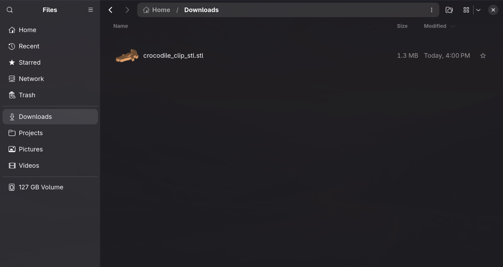

# STL Preview for Omarchy

Adds transparent .stl model thumbnails to GNOME Files on Omarchy, with install and removal controls in a Quattro bar widget. The widget uses a compact square 2×2 grid icon.

The thumbnails are for browsing, not a substitute for a 3D viewer when checking a model's shape or dimensions.

The installer adds a GTK style rule to Nautilus thumbnail widgets: transparent background, no border or shadow, and no extra padding or margin. Nautilus does not expose an STL-only GTK selector, so the rule also affects other thumbnails.

## Screenshot



Model: [Bag Clip Crocodile with Lock (Print in Place)](https://www.printables.com/model/1822754-bag-clip-crocodile-with-lock-print-in-place/).

## Install as an Omarchy Quattro plugin

Install the plugin with:

```bash
omarchy plugin add https://github.com/hajimetchi/omarchy_stl_preview.git --enable
```

The 2×2 grid icon appears in the bar's right section. Hover to see its **Manage .stl previews** tooltip, then click it and choose **Install .stl previews**. This opens an interactive terminal and runs `install.sh`; the script asks for your administrator password when it installs the renderer under `/usr/local/bin`. It records the renderer's checksum in `/var/lib/stl-preview/stl-thumbnailer.sha256`. If the executable already exists without a matching ownership record and checksum, installation stops without replacing it. The plugin does not run the installer automatically. The menu shows a per-user lifetime count of .stl thumbnail-generation events, saved in `~/.local/share/stl-preview/thumbnail-count.json` (or `$XDG_DATA_HOME/stl-preview/thumbnail-count.json`). Regenerating a thumbnail or creating it at another size may count as another event. It watches the user thumbnail cache because GNOME runs thumbnailers in a sandbox that cannot write to the stats file. Plugin updates and reinstallations reuse this count; removing the plugin directly preserves it too. The install action displays the original installation date and stays disabled after installation. The size slider sets a per-user input limit of 8, 16, 32, 64, or 128 MiB (default 16 MiB); files above the selected limit are skipped. This setting survives plugin updates.

Restart GNOME Files (close and reopen it, or log out and back in). Browse to a folder containing `.stl` files and use an icon or grid view. If thumbnails are disabled in Files, enable them in Files preferences. The first preview may take a moment to appear.

## Remove

Use **Remove .stl previews** in the widget before removing the plugin with `omarchy plugin remove io.github.hajimetchi.stl-preview`. The removal action asks whether to delete the per-user thumbnail count; declining keeps it available for a later installation. It asks for your administrator password to delete the renderer from `/usr/local/bin` only when its checksum matches this plugin's ownership record. If the executable has changed, removal leaves it in place. A user-level ownership record tracks the installed registrations and marked style block. Install stops if those destinations already exist without a matching record, or if a managed file or style block has since changed. Removal deletes only unchanged files and style content recorded as plugin-owned; edited or unowned content is left in place. Thumbnail caches are left untouched.

## Project files

| File | Purpose |
| --- | --- |
| `manifest.json`, `BarWidget.qml`, `Panel.qml`, `ActionButton.qml`, `icons/preview-grid.svg` | Declare and implement the Quattro widget, square 2×2 grid icon, thumbnail counter, and install/remove panel. |
| `install.sh` | Installs the renderer, registers the thumbnailer and STL file type for your account, and applies the Nautilus thumbnail style. Launched by the widget. |
| `uninstall.sh` | Removes the renderer and registrations, then removes only the style block added by this project. Launched by the widget. |
| `bin/stl-thumbnailer` | Python program that streams a bounded STL mesh and renders a transparent PNG thumbnail. |
| `set-file-cap.py` | Updates the installed thumbnailer's file size limit while checking its ownership record. |
| `thumbnail-counter.py` | Watches GNOME's user thumbnail cache and maintains the lifetime count outside the thumbnailer sandbox. |
| `share/thumbnailers/stl-preview.thumbnailer` | Tells GNOME which command to run to make thumbnails for STL files. |
| `share/mime/packages/stl-preview.xml` | Registers `.stl` files as STL models with the desktop file-type system. |
| `README.md` | Installation, removal, and project documentation. |

## How it works

GNOME Files uses the standard desktop thumbnailer system to request a PNG preview for an STL file. This project streams the mesh, projects its triangles into a shaded isometric-style view, and writes the thumbnail with a transparent background. It does not change the STL file itself. The renderer also enforces a 500,000-triangle ceiling and a bounded rasterization-work budget, independently of the selected file size cap.
